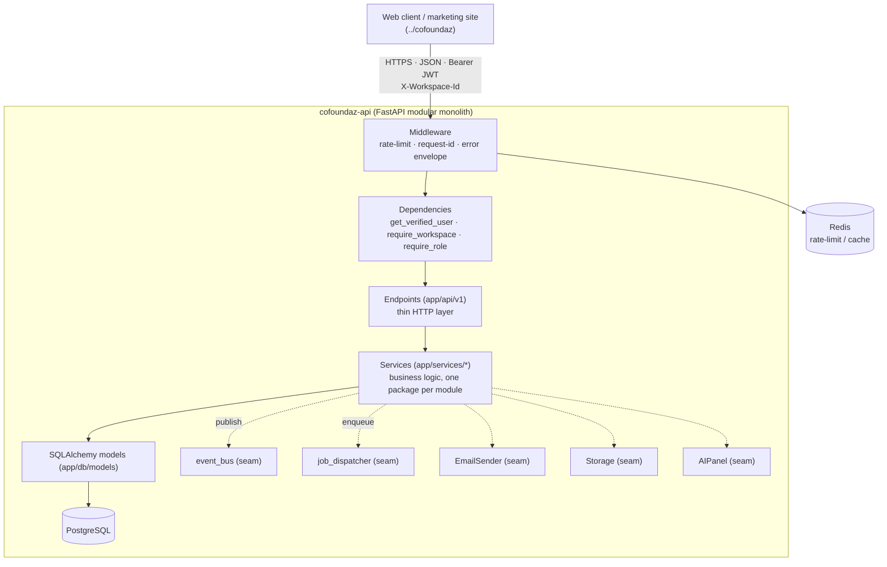
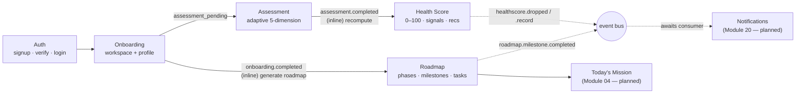

# cofoundaz-api

> The backend for **Cofoundaz** — an AI operating system for founders that takes a startup from
> idea to profitability. One workspace, one API, 26 product modules.

---

## What this is

**Cofoundaz** is an AI operating system for founders. Instead of stitching together a dozen
disconnected tools, a founder gets one workspace that understands their startup and actively helps
move it forward: a **Startup Health Score** that grades the business across five dimensions, a
**stage-based Roadmap** from idea to scale, a **daily Mission**, a bench of **AI advisors** (the
"AI Co-Founder"), and hubs for validation, marketing, sales, finance, legal, fundraising and more.

**`cofoundaz-api`** is the backend that powers the authenticated product (everything behind
`/app/*`) and the auth flows for the marketing site. It is a **modular monolith**: one FastAPI
application, cleanly separated into 26 product modules that share a common platform (auth, tenancy,
events, jobs, storage, email). The public marketing website and the web client live in a separate
repo (`../cofoundaz/`); this repo is the API they consume.

- **Spec / source of truth:** `../Cofoundaz_Technical_PRD.md` (module-by-module: entities,
  endpoints, events, permissions) and the UI handoff in `../cofoundaz/`.
- **Orientation for a fresh session:** `docs/backend-kickoff-brief.md`.

---

## Architecture at a glance

A layered modular monolith. A request enters through middleware, is authenticated and scoped to a
workspace, routed to a thin endpoint, which delegates to a service that owns the business logic and
talks to Postgres. Cross-cutting concerns (events, background jobs, email, file storage, AI) are
**platform seams** — swappable interfaces with simple v1 implementations.



**Key conventions (every module honors these):**

| Concern | Convention |
|---|---|
| **API surface** | All routes under `/api/v1`, JSON only. Auth via `Authorization: Bearer <JWT>`. |
| **Response shape** | Uniform envelope — success: `{ "data": … }`; error: `{ "error": { "code", "message", "field_errors" } }`. |
| **Multi-tenancy** | Every workspace-scoped request resolves `startup_id` from the `X-Workspace-Id` header + membership; cross-workspace ids return a **uniform 404** (no enumeration leak). |
| **RBAC** | Role-based: `founder` / `team_member` / `mentor` / … via `require_role(...)`. Reads usually open to any active member; writes gated to editors. |
| **Domain events** | `domain.entity.verb` (e.g. `roadmap.milestone.completed`) published to the event bus for future consumers (Notifications, Analytics, Health Score). |
| **Async jobs** | `POST …/generate`-style endpoints return `202 {job_id, status}`; pollable at `GET /api/v1/jobs/{id}`. v1 runs them **inline** behind the job seam (no external worker yet). |
| **Errors** | Fixed `SCREAMING_SNAKE` codes via an `AppError` taxonomy (`NOT_FOUND`, `VALIDATION_ERROR`, `FORBIDDEN`, `DEPENDENCY_CYCLE`, …). |

### How the core modules connect (data + event flow)

The shipped modules form a chain: onboarding creates the workspace, the assessment calibrates it,
that feeds the Health Score, and the Roadmap gives the founder a plan — each handing off through
events and jobs.



---

## Tech stack

- **Language / framework:** Python 3.11 · FastAPI 0.115 (async) · Pydantic v2
- **Data:** SQLAlchemy 2.0 (typed `Mapped`) · Alembic migrations · PostgreSQL (psycopg2)
- **Infra seams:** Redis (rate-limit / cache) · event bus · job dispatcher · email sender · object storage
- **Auth:** dual-transport JWT (httpOnly cookie for web + Bearer), refresh-token rotation with reuse detection, TOTP MFA
- **Tooling:** Poetry · pytest (real Postgres, per-test rollback) · black · isort · ruff · mypy
- **Local infra:** Docker Compose (Postgres + Redis)

## Repository structure

```
app/
  api/v1/            # HTTP layer — endpoints/ (one module per file/package) + api.py (router registry)
  core/              # envelope, errors, config, security (JWT), rate limiting
  db/                # models/, session, mixins, tenancy resolution
  middleware/        # request-id, error handling
  platform/          # the seams: events.py, jobs.py, email.py, storage.py, ai.py
  schemas/           # Pydantic request/response models
  services/          # business logic, one package per module (auth, onboarding, assessment,
                     #   health_score, roadmap, …)
  templates/email/   # email bodies
alembic/versions/    # migrations 0001 → 0007 (chained)
tests/               # unit/integration — core/ db/ api/ services/ (real Postgres, per-test rollback)
e2e/                 # live end-to-end suite (real server) + _captures/ (recorded real responses)
docs/
  superpowers/specs/     # per-change design specs (pre-work)
  superpowers/plans/     # per-change implementation plans (pre-work)
  sop/                   # Standard Operating Procedures — record of what shipped (post-work)
  checklist/             # the master build checklist (always-current bird's-eye map)
  deployment/            # CI/CD, compose, nginx/TLS, branching model, env encryption, rollback,
                         #   backups — the operator's manuals (DEPLOYMENT_GUIDE.md, NGINX_TLS.md,
                         #   BRANCHING.md and friends)
  fe-integration-guide-*.md  # the FE contract, every payload captured from a live response
  backend-kickoff-brief.md   # orientation for a fresh session
```

---

## Module status

**26 product modules total.** Built strictly module-by-module — each is designed, planned, built
test-first, reviewed, verified end-to-end with real data, and documented before the next begins.

### ✅ Shipped & certified (verified end-to-end with real data)

| # | Module | What it does | PR |
|---|---|---|---|
| 01 | **Auth & Onboarding** | Signup/verify/login, JWT + refresh rotation, TOTP MFA; 6-step resumable onboarding wizard, team invites, workspace creation | #1–#3 |
| 07 | **Startup Assessment** | Adaptive 5-dimension questionnaire (server-driven skip-logic), deterministic scoring | #4 |
| 06 | **Startup Health Score** | Explainable 0–100 score across Product/Market/Financial/Legal/Team, signals, trend, benchmarks, rule-based recommendations | #6 |
| 05 | **Roadmap** *(Slices 1–2 of 3)* | Stage-template-generated phases→milestones→tasks tree; full CRUD; derived progress/overdue; task dependencies with cycle detection; template gallery with non-destructive apply | #7, #8 |

*Health snapshot:* ~57 endpoints · **328 unit tests** (real Postgres) + **25 live E2E** · ~98%
coverage · black/isort/ruff/mypy clean · zero AI-attribution trailers · migrations `0001→0007`.

### 🟡 In progress

- **05 — Roadmap · Slice 3 (AI Re-plan)** — drift detection + a preview/apply diff of shifted
  milestones (never auto-applies). Closes out Module 05.

### ⬜ Remaining (22 modules, in suggested implementation order)

Ordered by dependency and leverage — foundational consumers first, AI-heavy and cross-cutting
modules once their inputs exist.

| Order | Module | Why here |
|---|---|---|
| 1 | **04 — Today's Mission** | Consumes the shipped Roadmap; self-contained daily generation. |
| 2 | **20 — Notifications** | Unblocks delivery for events already emitted across shipped modules (health-score drops, milestone overdue, template applied). High leverage. |
| 3 | **02 — Founder Dashboard** | Aggregation/BFF over Health Score + Roadmap + Mission — needs them to exist first. |
| 4 | **03 — AI Co-Founder** | The AI orchestration layer; unblocks deferred AI narratives/recommendations/re-plan. |
| 5 | **21 — Founder Journal** | Small, founder-only CRUD — a clean self-contained module. |
| 6 | **18 — Documents & Templates** | Object storage + metadata; reuses the Storage seam. |
| 7 | **19 — Calendar & Milestones** | CRUD + invites; ties to Roadmap milestones. |
| 8 | **17 — Learning Academy** | Content browsing/progress; low coupling. |
| 9 | **16 — Marketplace** | Provider/service listings. |
| 10 | **23 — Team Collaboration** | Comment threads reused by many modules. |
| 11 | **08 — Business Builder** | Canvases, personas, AI-fill, BC suggest-mode — needs AI + grants. |
| 12–18 | **09 Validation · 10 Marketing · 11 Sales · 12 Finance · 13 Legal · 14 Funding · 15 Investor Readiness** | The domain hubs; each substantial, several AI-assisted. |
| 19 | **22 — Analytics & Reports** | Aggregates across all hubs — late by nature. |
| 20 | **24 — Subscription & Billing** | Payment provider integration; can slot in when monetization is needed. |
| 21–22 | **25 — Admin Portal · 26 — Super Admin Portal** | Separate internal console; last. |

---

## How we work

Every module follows the same disciplined loop. We never "just start coding" — the design and plan
exist before implementation, and a module isn't done until it's verified with real data and
documented.

```mermaid
flowchart LR
    B["Brainstorm<br/>clarify → decide → sectioned design"] --> S["Spec<br/>docs/superpowers/specs/"]
    S --> P["Plan<br/>docs/superpowers/plans/<br/>bite-sized TDD tasks"]
    P --> BUILD["Build<br/>subagent-driven: fresh implementer per task"]
    BUILD --> REV["Review<br/>independent per-task + whole-branch"]
    REV --> V["Verify<br/>unit + sanity + smoke + live E2E (real data)"]
    V --> DOC["Document<br/>SOP + FE guide + checklist"]
    DOC --> PR["PR → develop<br/>full CI: lint · test · migrations · e2e ·<br/>security · quality · build"]
    PR --> STG["Staging deploy + live E2E gate<br/>(cd-staging.yml, on merge to develop)"]
    STG --> FF["Fast-forward develop → main<br/>(docs/deployment/BRANCHING.md)"]
    FF --> PROD["Production deploy<br/>(cd-production.yml — redeploys the<br/>staging-verified digest, no rebuild)"]
    PROD --> B
```



**Subagent-driven development.** Larger modules are decomposed into a plan of small, independently
testable tasks. Each task is implemented by a fresh worker, then gated by an **independent
reviewer** (spec-compliance + code quality) before the next task starts; the whole branch gets a
final review before the PR. This keeps context clean and catches defects early (real catches so
far: TOCTOU races, a PATCH-null 500, missing auth gates, scoring slips).

**Decomposition.** A module too big for one spec is split into **slices**, each its own
spec → plan → PR (e.g. Roadmap = Core / Dependencies+Templates / AI Re-plan).

### Testing strategy — four layers

Correctness is proven at increasing levels of realism. A module is only "certified" once it passes
all four with **real data**, not mocks.

| Layer | What it proves | How |
|---|---|---|
| **Unit / integration** | Each function/endpoint behaves, including edge cases & races | `pytest` against a **real Postgres** with per-test transaction rollback; TDD (test written first). |
| **Sanity** | The app boots, migrations apply cleanly `0001→latest`, the whole suite is green | full `make test` on a fresh migrated DB. |
| **Smoke** | Every endpoint is actually wired through the live ASGI stack (middleware, handlers, rate limiter) and answers its expected status | `e2e/test_smoke.py` asserts the OpenAPI surface + probes each route on a **real running server**. |
| **Live E2E (real data)** | The real user journey works over HTTP end-to-end | `make e2e` boots a **real uvicorn** on an isolated `cofoundaz_e2e` DB + Redis, walks the journey with real payloads, and **captures every response** to `e2e/_captures/` (which the FE guide then quotes verbatim). |

Gates that must be green before any PR: `pytest` · `black --check` · `isort --check` ·
`ruff check` · `mypy` · `make e2e`. Concretely, that's CI's full 8-job suite (`lint`, `test`,
`migrations`, `e2e`, `security`, `quality`, `dependency-review`, `build`) on a **PR targeting
`develop`** — `develop` is the only branch CI targets. A PR from `develop` into `main` runs no
CI at all, by design: `main` is fast-forwarded from an already-tested `develop` commit, so
nothing on that PR would be testing anything new. See `docs/deployment/BRANCHING.md`.

### How we document — three complementary artifacts

Documentation is part of shipping, not an afterthought. Three things travel with every change:

- **SOP** (`docs/sop/`) — the *record of what shipped* (post-work): what/why/how/verification/
  rollback/follow-ups. A teammate can understand a change from the SOP alone, without the diff.
- **Master checklist** (`docs/checklist/PROJECT_CHECKLIST.md`) — the always-current *bird's-eye map*
  of the whole build (done / in progress / ahead), as task lists. Never archived.
- **FE integration guide** (`docs/fe-integration-guide-*.md`) — the contract the frontend builds
  against. **Every payload is copied verbatim from a real captured response**, never written from
  the schema — so field-nesting, status codes, and error shapes are true, not guessed.

Pre-work design lives in `docs/superpowers/specs/` (design) and `docs/superpowers/plans/`
(task breakdown).

---

## Running it locally

Prerequisites: Python 3.11, Poetry, Docker (for Postgres + Redis).

```bash
# 1. install deps
make install

# 2. bring up Postgres + Redis
make docker-up

# 3. apply migrations
make migrate

# 4. run the API (http://localhost:8000, docs at /docs)
make run
```

Everyday commands:

```bash
make test        # unit/integration suite (real Postgres, per-test rollback)
make test-cov    # + coverage report
make e2e         # live end-to-end suite on a real server + isolated DB
make lint        # black --check, isort --check, ruff, mypy
make format      # black + isort (write)
make migrate-create m="describe change"   # autogenerate a migration
```

The API is versioned under `/api/v1`; interactive docs are served at `/docs` when running.

---

## Where to start (new contributor)

1. Read `docs/backend-kickoff-brief.md`, then the relevant module section of
   `../Cofoundaz_Technical_PRD.md`.
2. Skim a shipped module end-to-end to learn the patterns — **Roadmap** is a good exemplar:
   `app/services/roadmap/`, `app/api/v1/endpoints/roadmap.py`, its spec/plan/SOP under `docs/`, and
   its FE guide (`docs/fe-integration-guide-roadmap.md`).
3. Check `docs/checklist/PROJECT_CHECKLIST.md` for what's done and what's next.
4. Follow the loop above: brainstorm → spec → plan → build (TDD) → review → verify → document →
   **PR into `develop`** (never `main` directly — see `docs/deployment/BRANCHING.md`).
