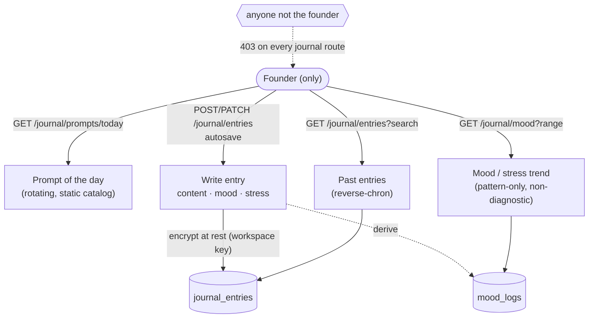
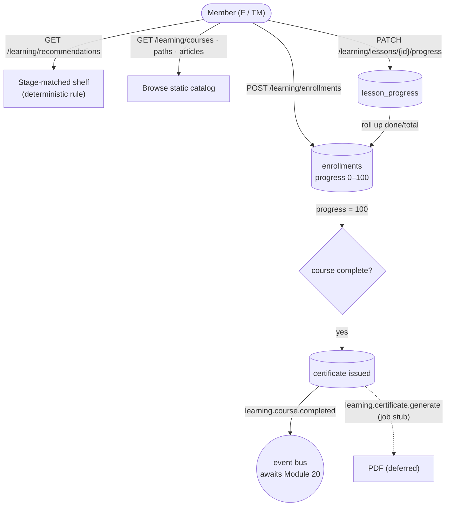

# Planned Blueprint — Modules 17 (Learning Academy) & 21 (Founder Journal)

**A junior-developer handoff package.** Produced with the `project-blueprint` skill in **`init`
mode** — the skeleton *before* code exists.

> **How to read this — the one rule that matters.** **Everything here is 🔵 INTENT: proposed, not
> built.** No endpoint, payload, table, or status code below has been verified against a running
> system — because none of it is running. These are a *starting contract* to build against, not
> facts. As you build each piece, capture the real response and promote it to 🟢 LIVE in the FE
> integration guide. A proposed shape that turns out wrong in the build is normal; a proposed
> shape mistaken for a verified one costs a day.
>
> **This does not replace your own design pass.** The genuine open decisions (§ each module's
> "Decisions you own") are yours to settle in a **brainstorm → spec → plan** loop before building.
> This blueprint *frames* those decisions; it does not make them. Companion detail:
> `docs/handoff/module-17-learning-academy.md`, `docs/handoff/module-21-founder-journal.md`.
> Authority: `../Cofoundaz_Technical_PRD.md` (Modules 17, 21). Conventions you must follow:
> `docs/architecture/system-architecture.md`.

---

## House rules (inherit these — they are 🟡 CODE today, not proposals)

These are how every shipped module already works; match them, don't reinvent.

- **Envelope.** Success → `{ "data": …, "meta": … }`. Error → `{ "error": { "code", "message", "field_errors":[{field,message}] } }`.
- **Auth.** `get_verified_user` = authenticated + email-verified. `require_workspace` = verified + active member of the `X-Workspace-Id` workspace. `require_role(founder)` = founder only.
- **Tenancy.** Scope every read/write to the caller's workspace; a foreign id returns a **uniform 404** (never leak existence).
- **Idempotency.** Safe re-clicks return `200`; contradictory repeats are loud. Copy the roadmap dependency / template-apply patterns.
- **Migrations.** Next slot is **`0008`** (chain head is `0007`). Coordinate the number if the other module lands first.
- **Ship discipline.** TDD (real Postgres, per-test rollback) → sanity → smoke → live E2E with real data → SOP + FE integration guide + checklist. A module is "done" only when verified end-to-end.

---

# Module 21 — Founder Journal 🔵

**What it is.** A private daily journal for the founder: write a short entry, log a mood + stress
level, get a gentle reflection prompt, and see mood trends over time. **Founder-only, hard-enforced
server-side** — the single most private surface in the product (even an admin gets `403`).

### Workflow / dataflow 🔵 INTENT



### Proposed API 🔵 INTENT · all `require_role(founder)` + verified

| Method | Path | Purpose |
|---|---|---|
| `POST` | `/api/v1/journal/entries` | Create / upsert today's entry (content, mood, stress) |
| `GET` | `/api/v1/journal/entries?search=&range=` | Reverse-chron list (date, mood, first line) |
| `GET` | `/api/v1/journal/entries/{id}` | One entry, decrypted for the founder |
| `PATCH` | `/api/v1/journal/entries/{id}` | Autosave edits |
| `DELETE` | `/api/v1/journal/entries/{id}` | Remove an entry |
| `GET` | `/api/v1/journal/mood?range=7d\|30d\|90d\|all` | Mood/stress series for the trend chart |
| `GET` | `/api/v1/journal/prompts/today` | Today's prompt from the static catalog |

### Proposed data model 🔵 INTENT · migration `0008`

- **`journal_entries`** — `id` (UUID PK) · `startup_id` FK→startups (CASCADE, indexed) · `founder_id` FK→users · `entry_date` (Date) · `content_encrypted` (Text/bytes) · `mood` (`Mood` enum) · `stress` (Integer 1–10) · timestamps. *Proposed:* unique `(startup_id, entry_date)` if one entry/day (**decision below**).
- **`mood_logs`** — `id` · `startup_id` · `entry_date` · `mood` · `stress`. *Proposed — may instead be derived from entries (**decision below**).*
- **New enum** `Mood(rough | meh | okay | good | great)` in `app/db/models/enums.py`.

### Proposed payloads 🔵 INTENT (shapes to build toward — verify on build)

```jsonc
// POST /journal/entries   { "content": "...", "mood": "good", "stress": 4 }   → 201
{ "data": { "id": "…", "entry_date": "2026-08-26", "mood": "good", "stress": 4,
            "content": "…(decrypted for the founder)…", "updated_at": "…" } }

// GET /journal/mood?range=30d → 200
{ "data": { "range": "30d",
            "series": [ { "date": "2026-08-01", "mood": "okay", "stress": 6 }, … ],
            "insight": null } }   // insight is pattern-only text or null — see decision

// GET /journal/prompts/today → 200
{ "data": { "prompt": "What surprised you this week?", "theme": "reflection" } }

// non-founder on any /journal route → 403
{ "error": { "code": "FORBIDDEN", "message": "…", "field_errors": [] } }
```

### ⚠️ Decisions you own (settle in a brainstorm before building)

1. **One entry per day, or many?** Drives the unique constraint and the upsert-vs-create shape.
2. **`mood_logs`: a real table, or derived from entries?** (YAGNI leans derived.)
3. **Encryption at rest — reuse, don't invent.** The MFA secret encryption (`app/services/auth/mfa.py` + the key in `app/core/config.py`) is your reference. Agree the exact key + helper with a senior. **Senior checkpoint.**
4. **Mood-trend copy is sensitivity-bound** — pattern-only, explicitly non-diagnostic; the sustained-low-mood card (PRD 21.3) uses exact, reviewed copy, or is left out of v1. **Senior checkpoint.**

### Non-goals for v1
Context-aware AI prompts (Module 03), milestone-linked retros, notification delivery (Module 20).

---

# Module 17 — Learning Academy 🔵

**What it is.** A learning hub: a catalog of **courses** (ordered **lessons**), **paths**, and
**articles**; **enroll** and track **progress**; earn **certificates** on completion; a
"recommended for you" shelf. Access **F + TM**; progress and certificates are **per-user**.

### Workflow / dataflow 🔵 INTENT



### Proposed API 🔵 INTENT · reads `require_workspace`; writes verified member (own records)

| Method | Path | Purpose |
|---|---|---|
| `GET` | `/api/v1/learning/recommendations` | Deterministic stage-matched course shelf |
| `GET` | `/api/v1/learning/courses` | Catalog + the caller's per-course progress |
| `GET` | `/api/v1/learning/courses/{id}` | Course detail + curriculum + caller's progress |
| `GET` | `/api/v1/learning/paths` | Learning paths (ordered course lists, completion %) |
| `GET` | `/api/v1/learning/articles` | Article index (search, tags) |
| `POST` | `/api/v1/learning/enrollments` | Enroll the caller in a course (idempotent) |
| `PATCH` | `/api/v1/learning/lessons/{id}/progress` | Mark a lesson complete → roll up → maybe issue certificate |
| `GET` | `/api/v1/learning/certificates` | The caller's earned certificates |

### Proposed data model 🔵 INTENT · migration `0008`

*User-state tables are real; the content catalog may be static config (**decision below**).*

- **`enrollments`** — `id` · `startup_id` · `user_id` FK→users · `course_id` (catalog key) · `progress` (Integer 0–100) · `completed_at` (nullable) · timestamps. Unique `(user_id, course_id)`.
- **`lesson_progress`** — `id` · `user_id` · `lesson_id` · `course_id` · `completed_at`. (Course `progress` rolls up from these — mirror `recompute_milestone_progress`.)
- **`certificates`** — `id` · `startup_id` · `user_id` · `course_id` · `credential_code` (unique) · `issued_at`.
- **New enum** `CourseLevel(beginner | intermediate | advanced)`.
- **Catalog** (`courses`, `lessons`, `paths`, `articles`) — *proposed as static versioned config* (`app/services/learning/catalog.py`), like the roadmap templates. Alternatively DB-backed (**decision below**).
- **Event** `learning.course.completed` `{startup_id, user_id, course_id, certificate_id}`.
- **Job (stub)** `learning.certificate.generate` — enqueue, no worker; PDF deferred.

### Proposed payloads 🔵 INTENT (verify on build)

```jsonc
// GET /learning/courses → 200
{ "data": [ { "id": "validation-basics", "title": "…", "level": "beginner",
              "duration_min": 45, "lesson_count": 6, "progress": 33 }, … ] }

// POST /learning/enrollments   { "course_id": "validation-basics" }   → 201 (200 if already enrolled)
{ "data": { "course_id": "validation-basics", "progress": 0, "already_enrolled": false } }

// PATCH /learning/lessons/{id}/progress   { "completed": true }   → 200
{ "data": { "course_id": "validation-basics", "progress": 100, "completed": true,
            "certificate": { "id": "…", "credential_code": "CFZ-…", "issued_at": "…" } } }
//        ↑ certificate present only when this completion took the course to 100%

// GET /learning/certificates → 200
{ "data": [ { "id": "…", "course_id": "…", "credential_code": "CFZ-…", "issued_at": "…" } ] }
```

### ⚠️ Decisions you own (settle in a brainstorm before building)

1. **Catalog in config or DB?** Recommend static config (matches the roadmap-template pattern; no CMS exists). Confirm so you don't build tables you'll throw away.
2. **The recommendation rule** — keep it deterministic (match `stage_tags` to the startup's stage, optionally the assessment's weakest dimension). **No AI** — that's Module 03.
3. **Certificate PDF** — stub it for v1 (record + `credential_code` + the `learning.certificate.generate` job). Don't pull in a PDF/rendering dependency without sign-off. **Senior checkpoint.**

### Non-goals for v1
AI-picked recommendations + reason line (Module 03), real PDF rendering / "Share to LinkedIn", video hosting (store a `video_ref` only), notifications (Module 20).

---

## Where this fits the build order

Both are self-contained, low-coupling modules chosen deliberately for a first solo module (see
`README.md` → "modules remaining"). **21 (Journal)** is the most isolated (founder-only, depends on
nothing else) but carries the two senior checkpoints (encryption, sensitive copy). **17 (Academy)**
is nuance-free but has more entities + two deliberate stubs. Suggested first pick for a very new
junior: **17**, keeping 21's checkpoints for once they've done one full loop.

## Verification posture

| Claim in this document | Provenance |
|---|---|
| House rules (envelope, auth, tenancy, idempotency, migrations) | 🟡 CODE — how shipped modules already work |
| Everything under Modules 17 & 21 (endpoints, schema, payloads, diagrams) | 🔵 INTENT — proposed, unbuilt; promote to 🟢 LIVE on build with captured responses |
| The open "Decisions you own" | 🔵 INTENT — genuinely undecided; resolve in the junior's brainstorm |

*Promote this from `init` toward `sync`/`verify` as each module ships — tick the checklist, capture real payloads into the FE integration guide, and move claims from 🔵 to 🟢.*
