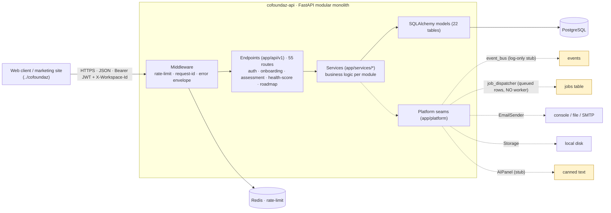
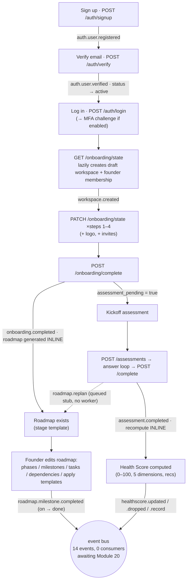

# Cofoundaz — System Architecture & Workflow

**Status:** Backend modular monolith. 4 of 26 product modules live end-to-end (Auth+Onboarding, Assessment, Health Score, Roadmap Slices 1–2); 22 planned. API-only — no async worker, no external providers wired yet.
**Last synced:** 2026-08-25 · `main` @ `4b71ed2` · 313 test functions (328 passing cases) + 25 live E2E · migrations `0001→0007`

> **How to read this.** Every factual claim is marked with its source:
> 🟢 **LIVE** — observed from a running system (captured E2E response / DB query) ·
> 🟡 **CODE** — read from source (`file:line`) ·
> 🔵 **INTENT** — planned, not built (PRD) ·
> ⚠️ **UNVERIFIED** — could not be checked; reason given inline.
> Do **not** read 🔵 as behaviour that exists today. `🟡 CODE` means "the code declares this," which is not the same as "the server does this" — where a claim was checked against a running system it is marked 🟢.

---

## 1. Status snapshot

The product is 26 modules (per the Technical PRD). Backend build order to date has been foundation → the core founder-calibration chain (Auth → Onboarding → Assessment → Health Score → Roadmap).

| # | Module | Status | Evidence | Notes |
|---|---|---|---|---|
| 01 | **Auth & Onboarding** | 🟢 Live | PRs #1–#3 · 15 auth + 5 onboarding + 2 invitation endpoints | JWT + refresh rotation, TOTP MFA; 6-step wizard, invites |
| 07 | **Startup Assessment** | 🟢 Live | PR #4 · 7 endpoints | Adaptive 5-dimension questionnaire, deterministic scoring |
| 06 | **Startup Health Score** | 🟢 Live | PR #6 · 7 endpoints | Explainable 0–100 score, signals, trend, rule-based recs |
| 05 | **Roadmap** (Slices 1–2 of 3) | 🟢 Live | PRs #7–#8 · 17 endpoints | Tree + CRUD + derived progress; dependencies + template gallery |
| 05 | Roadmap · Slice 3 (AI Re-plan) | 🔵 Planned | — | Drift detection + preview/apply diff |
| 04 | Today's Mission | 🔵 Planned | — | Next in build order; consumes the Roadmap |
| 20 | Notifications | 🔵 Planned | — | **14 emitted events currently have no consumer** (§ Events) |
| 02, 03, 08–19, 21–26 | Dashboard, AI Co-Founder, hubs, admin, … | 🔵 Planned | — | 22 modules remaining (§7) |

**Platform posture (🟡 CODE):** in-process event bus (log-only), job dispatcher that persists `queued` rows with **no worker draining them**, email via console/file/SMTP backends, local-disk storage, an AI stub. These are deliberate v1 seams — see §5.4 and §7.

---

## 2. System map

🟡 CODE — derived from `app/` structure, `app/platform/`, and `docker-compose.yml`.



*(Amber = stubbed seam: present in code, not a real delivery/processing backend yet. No external third-party providers are wired.)*

---

## 3. End-to-end workflow — the founder calibration journey

🟢 LIVE — this whole chain is exercised by the E2E suite (`e2e/`, `make e2e`, 25 passing). The events/jobs annotations are 🟡 CODE (`file:line` in §5.4).



**Two behaviours a reader must not misread (🟡 CODE):**
- **"Jobs" here are synchronous.** `roadmap.generate` runs `generate_roadmap(...)` inline and the job row is hand-set to `succeeded` immediately (`onboarding/complete.py:47`, `roadmap.py:211`). It is an audit record of synchronous work, **not** async processing. `roadmap.replan` and `healthscore.initialize` are enqueued as `queued` and **never processed** — no worker exists.
- **Health Score is pending until the assessment.** Onboarding-complete does *not* compute a score; `GET /health-score` returns `status:"pending_assessment"` until the first assessment completes (🟢 LIVE, `e2e/_captures/health_score/overview_pending.json`).

---

## 4. Screen-by-screen contracts

The section designers and frontend engineers build against. Health Score and Roadmap payloads are 🟢 LIVE (captured verbatim from the E2E harness on the dates noted). Auth/Onboarding/Assessment behaviours are 🟢 LIVE (their E2E journeys pass) but their exact response bodies below are 🟡 CODE — not yet written to capture files.

### Screen — Health Score overview
**User is doing:** viewing their startup's health at a glance.
**Endpoint:** `GET /api/v1/health-score` · auth: verified workspace member.
**Provenance:** 🟢 LIVE — captured 2026-08-19 (`e2e/_captures/health_score/overview_ok.json`, `…/overview_pending.json`).

Two shapes, keyed by `data.status`:

```jsonc
// status = "ok"
{ "data": { "status": "ok", "score": 31, "band": "at_risk", "delta_7d": 0,
    "computed_at": "…", "config_version": 1,
    "dimensions": [ { "key": "money", "label": "Financial", "score": 43, "band": "needs_work" }, … ],
    "top_recommendations": [ { "id": "…", "dimension": "legal", … } ] } }
// status = "pending_assessment"
{ "data": { "status": "pending_assessment", "score": null, "band": null,
    "message": "Complete your kickoff assessment to generate your Health Score.",
    "dimensions": [], "top_recommendations": [] } }
```

**Traps**
- **Branch on `data.status`, not on `score`.** In the pending state `score`/`band` are `null` and `dimensions`/`top_recommendations` are `[]` — not absent.
- **`key` ≠ `label`.** The internal dimension key `money` renders as the label **`"Financial"`** (🟢 LIVE — the mapping is in the payload). Bind display to `label`, joins/logic to `key`.
- Bands are machine keys: `at_risk | needs_work | healthy | thriving`. The FE owns display colour/copy.

**States to design for:** `pending_assessment` (CTA to start the assessment) · `ok` · loading · error.

### Screen — Roadmap (Timeline / Kanban / Milestones)
**User is doing:** viewing and editing their plan from idea to scale.
**Endpoint:** `GET /api/v1/roadmap` · auth: verified workspace member (lazily generates on first read).
**Provenance:** 🟢 LIVE — captured 2026-08-22 (`e2e/_captures/roadmap/get_tree*.json`).

Tree: `data.{ roadmap, current_stage, phases[] }`; `phases[].milestones[].tasks[]`.

```jsonc
{ "data": { "roadmap": { "id":"…","stage":"validation","template_key":"stage.validation","generated_at":"…" },
  "current_stage": "validation",
  "phases": [ { "id":"…","name":"Validation","order":0,"starts_on":"2026-08-22","ends_on":"2026-10-03",
    "milestones": [ { "id":"…","title":"…","due_on":"…","owner":{"id":"…","name":"Amara"}|null,
      "status":"todo|in_progress|done","progress":60,"overdue":false,"order":0,"dependency_count":0,
      "tasks": [ { "id":"…","title":"…","effort":"small|medium|large","status":"…",
        "assignee":{"id","name"}|null,"due_on":"…","overdue":false,"order":0,"depends_on":[] } ] } ] } ] } }
```

**Traps**
- **`depends_on` and `dependency_count` are populated ONLY on this tree endpoint.** The single-item create/patch responses (`POST/PATCH /milestones`, `…/tasks`) return the flat shape *without* `tasks[]`/`dependency_count`, and tasks there carry `depends_on: []` regardless. Read dependencies from the tree or `GET /roadmap/dependencies` — never from a CRUD response. (🟢 LIVE — `_captures/roadmap/task_create.json` vs `get_tree_with_deps.json`.)
- **`progress` is backend-derived** from child-task completion — do **not** let the user hand-edit it. `overdue` is derived (`due_on < today && status ≠ done`), never stored.
- `owner`/`assignee` are `{id,name}` objects **or `null`** (never absent).

**Must be surfaced:** milestone `overdue` (danger chip); a milestone can be marked `done` with zero tasks (`progress` snaps to 100).

### Screen — Dependencies graph
**Endpoint:** `GET /api/v1/roadmap/dependencies` · verified member. **Provenance:** 🟢 LIVE (`_captures/roadmap/dependencies_graph.json`).
`data.{ nodes:[{task_id,title,milestone_id,milestone_title,phase_id,phase_name}], edges:[{task_id,depends_on_task_id}], list:[{task,depends_on}] }` (`list` carries titles for "X → depends on → Y" rows).
**Trap / must-surface:** creating an edge that would close a loop returns **`409 DEPENDENCY_CYCLE`** with a human message (🟢 LIVE `dependency_cycle.json`): `"That would create a loop — Task A already depends on Task B."` — surface this inline, don't swallow it.

### Screen — Template gallery
**Endpoints:** `GET /roadmap/templates` (list, per-roadmap `applied` flag) · `GET /roadmap/templates/{id}` (preview) · `POST /roadmap/templates/{id}/apply` (editor). **Provenance:** 🟢 LIVE (`templates_list.json`, `template_apply.json`).
List item: `{id,title,stage,category,milestone_count,task_count,applied}`. Apply returns `{already_applied:false, added:{phases,milestones,tasks}}` on first apply and `{already_applied:true, added:{0,0,0}}` on re-apply (idempotent — nothing duplicated).
**Must surface:** the apply modal's promise — "merges into your roadmap, nothing gets deleted" — is true (append-only).

### Error envelope (all endpoints, 🟢 LIVE)
Errors are `{ "error": { "code", "message", "field_errors":[{field,message}] } }` (e.g. `validation_error.json`, `dependency_cycle.json`). Success is `{ "data": …, "meta": … }`.

---

## 5. Data model

🟡 CODE — 22 tables, 17 enums (`app/db/models/`), migrations `0001→0007`.

### 5.1 Domain map

| Area | Tables |
|---|---|
| **Auth** | `users`, `user_profiles` (PK = user_id), `auth_sessions` (refresh families), `auth_tokens` (verify/reset), `mfa_backup_codes`, `oauth_accounts` |
| **Tenancy** | `startups`, `startup_profiles` (PK = startup_id; `goals[]`, `assessment_pending`), `memberships` (unique `(user_id, startup_id)`) |
| **Onboarding** | `invitations` (unique `token_hash`) |
| **Assessment** | `assessments`, `assessment_answers` (unique `(assessment_id, question_key)`), `assessment_results` (PK = assessment_id) |
| **Health Score** | `health_scores` (unique `startup_id`), `health_score_history`, `health_signals`, `health_recommendations` (unique `(startup_id, key)`) |
| **Roadmap** | `roadmaps` (unique `startup_id`, `applied_template_keys` JSONB), `roadmap_phases`, `roadmap_milestones`, `roadmap_tasks`, `roadmap_task_dependencies` (composite PK) |
| **Platform** | `jobs` (`startup_id` is an unconstrained UUID — no FK), `audit_log` (all actor/entity UUIDs unconstrained — no FK) |

### 5.2 Composite / natural keys (single-writer unless noted)
- `roadmap_task_dependencies (task_id, depends_on_task_id)` — one writer `add_dependency` (`dependencies.py:51`), cycle-checked (`would_create_cycle`, DFS, `dependencies.py:31`).
- `health_recommendations (startup_id, key)` — created in `generate_recommendations` (`recommendations.py:36`); status updated separately in `resolve_recommendation` (`service.py:326`). Dismissed keys are never resurrected (`recommendations.py:51`).
- `memberships (user_id, startup_id)` — **two writers**: workspace bootstrap (`workspace.py:29`) and invite acceptance (`invites.py:121`, which pre-checks for an existing row to avoid the unique violation). Confirmed both produce the same key shape.
- `assessments` partial-unique on `startup_id WHERE status='in_progress'` — race-safe insert-or-resume via SAVEPOINT (`assessment/service.py:65`).
- `roadmaps.startup_id` / `health_scores.startup_id` — race-safe `INSERT … ON CONFLICT` (`roadmap/service.py:44`; `health_score/service.py:96`).

### 5.3 State machines (🟡 CODE — with the dead states called out)

```mermaid
stateDiagram-v2
    direction LR
    state "Assessment" as A {
        [*] --> in_progress
        in_progress --> completed
        note right of completed : abandoned declared, never written
    }
    state "Recommendation" as R {
        [*] --> pending
        pending --> accepted
        pending --> dismissed
        note right of dismissed : accepted↔dismissed cross → 409; dismissed never resurrected
    }
    state "Roadmap milestone/task" as RM {
        [*] --> todo
        todo --> in_progress
        in_progress --> done
        note right of done : PATCH is UNRESTRICTED — any→any; no guard enforced
    }
```



**Declared-but-never-written enum values (⚠️ drift — see §10):** `UserStatus.locked` / `.disabled` (lockout uses `locked_until`/`failed_login_count` instead) · `MembershipStatus.suspended` / `.removed` (no membership-management endpoint) · `InvitationStatus.expired` / `.revoked` (expiry read from `expires_at`, not materialized) · `AssessmentStatus.abandoned` · `JobStatus.running` / `.failed` / `.cancelled` (dispatcher is a stub). These states exist in the enum but no code path produces them — a reader must not assume the behaviour exists.

### 5.4 Events & jobs (🟡 CODE)

**14 domain events, all fire-and-forget, ZERO consumers** (`LogEventBus` only logs; no subscribe/handler anywhere): `auth.user.registered/verified`, `workspace.created`, `workspace.member.invited/joined`, `onboarding.completed`, `notification.onboarding_complete`, `assessment.completed`, `healthscore.updated/dropped/record`, `roadmap.generated/template.applied/milestone.completed`. All await **Module 20 (Notifications)**.

**3 job types** (`job_dispatcher.enqueue`, no worker): `roadmap.generate` (run inline → `succeeded`, audit record), `roadmap.replan` (unconsumed `queued` stub), `healthscore.initialize` (unconsumed `queued` stub).

**Seams** (`app/platform/`): `events` (log stub) · `jobs` (queued-row stub) · `email` (Console stub / File semi-real for E2E / SMTP real) · `storage` (LocalStorage, disk-only) · `ai` (StubAIPanel, canned text). `audit.write_audit()` is a real DB helper.

---

## 6. Endpoint index

🟡 CODE — 55 routes under `/api/v1` (+2 top-level in `main.py`: `GET /`, `GET /health`). Auth key: **verified** = authenticated + email-verified; **member** = verified + active member of `X-Workspace-Id`; **founder** / **editor (founder|team_member)** = role-gated; **public** = no bearer required.

| Module | Method | Path | Auth |
|---|---|---|---|
| health | GET | `/health` · `/api/v1/health` | public |
| jobs | GET | `/api/v1/jobs/{job_id}` | member of the job's workspace (fixed 2026-08-26) |
| auth | POST | `/auth/signup` · `/auth/verify` · `/auth/verify/resend` | public |
| auth | POST | `/auth/login` · `/auth/mfa/challenge` · `/auth/refresh` · `/auth/logout` | public (credential/token) |
| auth | POST | `/auth/password/forgot` · `/auth/password/reset` | public |
| auth | POST | `/auth/mfa/totp/setup` · `/auth/mfa/totp/verify` | authenticated |
| auth | GET | `/auth/me` | authenticated |
| auth | POST | `/auth/oauth/{provider}` · `/auth/mfa/sms/setup` · `/auth/mfa/sms/verify` | **501 seam** |
| onboarding | GET·PATCH | `/onboarding/state` | verified |
| onboarding | POST | `/onboarding/logo` · `/onboarding/invites` · `/onboarding/complete` | verified |
| invitations | GET | `/invitations/{token}` | public (preview) |
| invitations | POST | `/invitations/accept` | verified |
| assessments | POST | `/assessments` · `…/{id}/answers` · `…/{id}/complete` | founder |
| assessments | GET | `…/{id}/next-question` | founder |
| assessments | GET | `/assessments` · `/assessments/compare` · `/assessments/{id}` | member |
| health-score | GET | `/health-score` · `…/dimensions/{dim}` · `…/benchmarks` · `…/recommendations` · `…/history` | member |
| health-score | POST | `…/recommendations/{id}/accept` · `…/dismiss` | founder |
| roadmap | GET | `/roadmap` · `…/dependencies` · `…/templates` · `…/templates/{id}` | member |
| roadmap | POST | `/roadmap/generate` · `…/templates/{id}/apply` | editor |
| roadmap | POST·PATCH·DELETE | `…/phases[/{id}]` · `…/milestones[/{id}]` · `…/tasks[/{id}]` | editor |
| roadmap | POST·DELETE | `…/tasks/{id}/dependencies[/{dep}]` | editor |

Full method-by-method table with `file:line` is regenerable from `app/api/v1/endpoints/` (extraction 2026-08-25).

---

## 7. What is NOT built

Being explicit here stops a diagram implying a shipped feature.

- **22 of 26 modules are not started** — Dashboard (02), AI Co-Founder (03), Today's Mission (04), Business Builder (08), Validation/Marketing/Sales/Finance/Legal/Funding/Investor hubs (09–15), Marketplace (16), Learning Academy (17), Documents (18), Calendar (19), **Notifications (20)**, Journal (21), Analytics (22), Team Collaboration (23), Billing (24), Admin/Super-Admin (25–26). Roadmap **Slice 3 (AI Re-plan)** is also pending.
- **No async worker.** The job dispatcher persists rows; nothing drains them. All "jobs" that matter run inline.
- **No event delivery.** 14 events are emitted to a log-only bus; notifications/analytics consumers don't exist yet (Module 20).
- **AI is a stub.** Narratives, recommendations rationale, and re-plan reasoning are deterministic/templated; no model is called (Module 03).
- **No external providers wired** — no real email domain (console/file in dev), no OAuth/SMS (501 seams), no payment provider, cloud storage is local-disk only.
- **Per-module grants & suggest-mode RBAC** (PRD's `▢` / `R/S`) are **not** implemented — access is plain role-based (founder/team_member/mentor).

---

## 8. Open questions

**Blocking nothing today, worth deciding before the surface grows:**
- ✅ **RESOLVED (2026-08-26)** — ~~`GET /jobs/{job_id}` was unauthenticated and cross-tenant readable~~. Now requires a verified user + active membership of the job's workspace; uniform 404 otherwise (`jobs.py`, `docs/sop/2026-08-26-jobs-endpoint-auth.md`).
- **Roadmap milestone/task status has no transition guard** — `PATCH` does a generic `setattr`, so any status → any status (`roadmap.py:456`). Intentional (founder freedom) or should `done`→`todo` etc. be constrained? → **product**
- **Dead enum states** (§5.3): should `MembershipStatus.suspended/removed`, `InvitationStatus.expired/revoked`, `AssessmentStatus.abandoned` be wired (they imply features — member suspension, invite revocation, assessment abandonment), or removed from the enums to stop implying capability? → **product / backend**
- **Concurrent double-apply / double-add-dependency** have no row lock (benign under single-user editing; noted in SOPs). Revisit if multi-editor concurrency becomes real. → **backend**

---

## 9. Verification table

| Behaviour | Verified how |
|---|---|
| Full founder journey (signup→verify→login→onboard→assessment→health score→roadmap) | 🟢 LIVE — `make e2e`, 25 passing, DB migrated `0001→0007` |
| Health Score overview (ok + pending shapes, `money`→"Financial" label) | 🟢 LIVE — `e2e/_captures/health_score/overview_ok.json`, `overview_pending.json` (2026-08-19) |
| Roadmap tree, CRUD, derived progress, dependency graph, cycle 409, template apply/idempotency | 🟢 LIVE — `e2e/_captures/roadmap/*.json` (2026-08-22) |
| Error envelope + field_errors | 🟢 LIVE — `validation_error.json`, `dependency_cycle.json` |
| Endpoint inventory (55 routes) | 🟡 CODE — extracted from `app/api/v1/endpoints/` (2026-08-25) |
| Data model (22 tables, 17 enums, state machines) | 🟡 CODE — `app/db/models/` + migrations |
| Events (14) / jobs (3) / seams | 🟡 CODE — `event_bus.publish` / `job_dispatcher.enqueue` call sites |
| `GET /jobs/{id}` tenancy | 🟢 LIVE — secured 2026-08-26 (member-of-workspace, uniform 404); 5 tests + e2e |
| Auth/Onboarding/Assessment exact response bodies | ⚠️ UNVERIFIED as captures — behaviour is 🟢 LIVE (their E2E journeys pass) but payloads not yet written to `_captures/`; shapes above are 🟡 CODE |
| Anything requiring a real provider (SMTP send, OAuth, payments) | ⚠️ UNVERIFIED — not wired (§7) |

---

## 10. Drift detection

Checked doc/claim vs. reality this sync. Nothing was silently "fixed" — conflicts are surfaced for a human to decide.

| Claim | Source of claim | Reality | Verdict |
|---|---|---|---|
| "~57 endpoints" | `README.md` | 55 under `/api/v1` + 2 top-level = 57 | ✅ accurate |
| "328 unit tests" | `README.md` | 313 test **functions**; **328 passing cases** (parametrization) | 🟡 imprecise wording — both numbers true; prefer "313 tests / 328 cases" |
| `GET /jobs/{job_id}` unauthenticated | drift found this sync | **Was** public/cross-tenant; **now** member-scoped, uniform 404 | ✅ resolved 2026-08-26 |
| Status enums model real lifecycles | enum definitions | 8 enum values across 5 enums are **never written** by any code path (§5.3) | ⚠️ drift — enums over-state capability |
| "roadmap.generate is an async job" | the `202 {job_id}` contract | Runs **inline**, job hand-set to `succeeded`; no worker | 🟡 contract-shaped, synchronous in truth (documented in §3) |
| Roadmap status follows todo→in_progress→done | the enum's natural reading | `PATCH` enforces **no** transition graph (any→any) | 🟡 drift — behaviour looser than the enum implies |
| Modules 01/06/07 + Roadmap Slices 1–2 "merged" | this doc / README | PRs #1–#8 all merged into `main` (`git`) | ✅ verified |

---

*Regenerate this document with the `project-blueprint` skill (`sync` after each module ships, `verify` before presenting). The Artifact companion is generated from this file — edit here, not there.*
