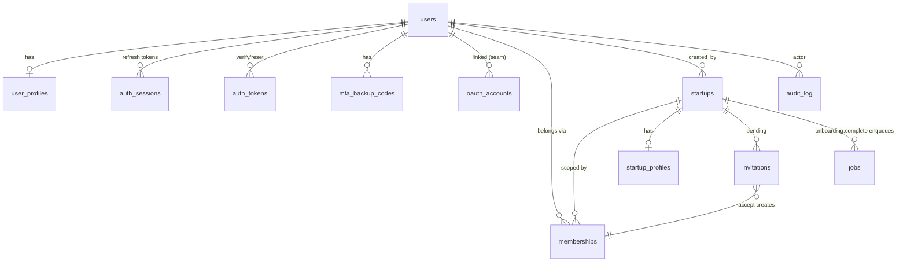

# Design — Foundation + Module 01 (Authentication & Onboarding)

> **Status:** Approved (brainstorm) · **Date:** 2026-08-12 · **Repo:** `cofoundaz-api`
> **Sources of truth:** `docs/backend-kickoff-brief.md`, `../Cofoundaz_Technical_PRD.md`
> (§0, §2.1, §2.2, Module 01), and the live FE contract in `../cofoundaz/`
> (`app/(auth)/*`, `content/auth.ts`).
>
> This is the **design spec** for the first backend slice. It precedes the
> implementation plan (writing-plans) and the post-ship SOP (`docs/sop/`).

---

## 1. Scope

**This build = the shared platform foundation + all of Module 01.** Jobs, events,
realtime, AI orchestration, and billing are **stubbed behind clean interfaces**
and made real in their own later modules.

**In scope**

- Shared platform layer (envelope, errors, pagination, idempotency, RBAC, tenancy,
  rate limiting, audit, and stub seams for jobs/events/AI).
- Module 01 auth: signup, email verification, login (with lockout), **TOTP MFA +
  backup codes**, password forgot/reset, refresh-token rotation, `GET /me`.
- Module 01 onboarding: 6-step resumable wizard with autosave, team invites,
  `POST /complete` enqueuing stub jobs, and invitation acceptance.

**Explicitly deferred (seam only, no implementation)**

| Deferred | Seam shipped now | Built in |
|---|---|---|
| SMS MFA | `mfa_type` enum + `/auth/mfa/sms/*` → `501` | when SMS provider chosen |
| Google/Apple OAuth | `oauth_accounts` table + `/auth/oauth/{provider}` → `501` | when OAuth creds exist |
| Async worker (Celery/ARQ) | `JobDispatcher` protocol + `jobs` table (rows `queued`) | Modules 05 / 06 |
| Event bus | `EventBus` protocol (in-process/log impl) | later |
| Onboarding AI panel | `AIPanel` protocol (canned responses) | Module 03 |
| Realtime WebSockets | — (not needed for auth) | later |
| Billing / AI credits | — | Module 24 |
| Transactional email / object storage | `EmailSender` + `Storage` protocols with dev impls | later (swap impl) |

## 2. Decisions (locked in brainstorming)

| # | Decision | Choice |
|---|---|---|
| 1 | Architecture shape | **Modular monolith**, single FastAPI deploy; PRD "services/gateway" = internal packages + dependencies, not processes |
| 2 | RBAC spine | First-class **`memberships`** many-to-many join, one coarse role per membership; extensible to per-module grants later without migration |
| 3 | Sessions | **DB `auth_sessions` + refresh rotation** with reuse-detection; short access JWT |
| 4 | Token transport | **Dual:** web = refresh in `httpOnly Secure SameSite=Lax` cookie + access in body (memory); mobile/API = both in body. API stays transport-agnostic |
| 5 | MFA | **TOTP + 10 backup codes now**; SMS deferred behind `mfa_type` seam |
| 6 | OAuth | **Seam now** (`oauth_accounts` + routes), flows deferred |
| 7 | Providers | **Interfaces + dev impls:** `EmailSender` (console + SMTP), `Storage` (local FS); real providers swap in later |
| 8 | DB conventions | **UUID PKs** (uuid4), `TimestampMixin`, opt-in soft-delete, snake_case plural tables, SQLAlchemy 2.0 typed, constraint naming conventions, tenant-scope helper |
| 9 | Testing | **Real Postgres** container + per-test transaction rollback, factory helpers, ~85% coverage gate, TDD |

**Token TTLs:** access **15 min**, refresh **30 days** (both configurable via settings).

## 3. Architecture

Modular monolith. Logical PRD "services" become packages under `app/modules/`;
cross-cutting concerns become `app/platform/` seams every module depends on.

```
app/
  core/          config, security, logging, envelope, errors, deps
  db/            base, session, models/, mixins, tenancy helpers
  platform/
    rbac.py        require_role(...) route dep + tenant_scope(...) row policy
    jobs.py        JobDispatcher protocol  → StubDispatcher (writes queued jobs row)
    events.py      EventBus protocol       → InProcess/Log bus
    ai.py          AIPanel protocol        → StubAI (canned onboarding replies)
    ratelimit.py   slowapi wiring (120/min/user)
    email.py       EmailSender protocol    → Console + SMTP impls (Jinja2 templates)
    storage.py     Storage protocol        → LocalFS impl
    audit.py       write_audit(...) helper
  modules/
    auth/          router, service, schemas, models   (/api/v1/auth)
    onboarding/    router, service, schemas, models   (/api/v1/onboarding)
    jobs/          read-only GET /api/v1/jobs/{id}     (contract for stub jobs)
```

**Why modular monolith:** delivers the module boundaries the PRD wants (ownership,
independent tests) without distributed-systems overhead before the traffic/team
justify it. Seams (`JobDispatcher`, `EventBus`, `AIPanel`) make later extraction a
refactor, not a now-commitment — callers depend on the protocol, not the impl.

## 4. Shared platform layer

| Concern | v1 implementation |
|---|---|
| **Envelope** | `success_response(data, meta=None)` / `error_response(...)`; `{data, meta}` on success |
| **Errors** | `AppError(code, message, http_status, field_errors=[])` base + subclasses; one exception handler renders `{error:{code,message,field_errors}}`; FastAPI validation errors remapped into `field_errors` |
| **Pagination** | opaque base64 `cursor` (encodes `created_at,id`) → `meta:{next_cursor,total_estimate}` |
| **Idempotency** | `Idempotency-Key` dep → Redis `SETNX` on `(user,key)` storing first response; replays return it. Applied to signup, invites, complete |
| **RBAC** | `require_role(*roles)` route dep (gateway) **+** `tenant_scope(startup_id)` service helper filtering by membership |
| **Tenancy** | active workspace from `X-Workspace-Id` header, validated against `memberships`, cached in Redis; never trusted from token alone. (Onboarding endpoints resolve the user's single draft workspace instead.) |
| **Jobs/Events/AI** | stub protocols; `onboarding.complete` → `jobs.enqueue(...)` writes `queued` rows |
| **Rate limiting** | `slowapi` 120/min/user; `429 + Retry-After` in envelope shape |
| **Audit** | `audit_log` + `write_audit(...)`; auth events write from day one |

## 5. Data model

Twelve tables: identity/auth, workspace/tenancy, membership/invites, platform stubs.
All inherit UUID PK + `TimestampMixin`; soft-delete (`deleted_at`) opt-in where noted.



### 5.1 Identity & auth

**`users`** — identity + auth state only (soft-delete on).

| Column | Type | Notes |
|---|---|---|
| `id` | UUID PK | |
| `email` | CITEXT | UNIQUE, NOT NULL |
| `password_hash` | TEXT | **nullable** (null = OAuth-only) |
| `status` | enum `user_status` | `pending_verification\|active\|locked\|disabled` (default `pending_verification`) |
| `email_verified_at` | timestamptz | null until verified |
| `mfa_type` | enum `mfa_type` | `none\|totp\|sms` (default `none`) |
| `mfa_secret` | TEXT | **app-encrypted (Fernet)**, key from settings; null until TOTP enabled |
| `mfa_enabled_at` | timestamptz | |
| `failed_login_count` | int | default 0 |
| `locked_until` | timestamptz | lockout window (5 fails / 15 min) |
| `last_login_at` | timestamptz | |

**`user_profiles`** (1:1 with users) — step-1 Founder Profile.
`user_id` PK/FK · `full_name` · `role_title` (default *"Founder & CEO"*) · `country` ·
`phone?` · `how_heard?` · `avatar_url?`. Split out so signup stays email+password only
and the hot `users` row stays lean.

**`auth_sessions`** — refresh-token store.
`id` · `user_id` FK · `refresh_token_hash` (SHA-256; token itself never stored) ·
`family_id` UUID (rotation lineage) · `ip` · `user_agent` · `expires_at` ·
`rotated_at?` · `revoked_at?`. Indexes: `user_id`, `family_id`, unique `refresh_token_hash`.
**Reuse detection:** presenting an already-rotated token revokes the whole `family_id`.

**`auth_tokens`** — unified single-use tokens.
`id` · `user_id` FK · `purpose` enum `email_verification|password_reset` ·
`token_hash` (unique) · `expires_at` (24h verify / short reset) · `consumed_at?`.

**`mfa_backup_codes`** — `id` · `user_id` FK · `code_hash` · `consumed_at?`.
10 per generation; regenerating invalidates the prior set.

**`oauth_accounts`** *(seam — shipped, flow deferred)* —
`id` · `user_id` FK · `provider` enum `google|apple` · `provider_account_id` ·
`email`. Unique `(provider, provider_account_id)`.

*MFA challenge state is **Redis-only** (`mfa_ticket` → user_id, 5-min TTL), not a table.*

### 5.2 Workspace & tenancy

**`startups`** (workspace, soft-delete on) —
`id` · `name` · `description?` · `website?` · `logo_url?` ·
`industry?` · `business_model?` enum `b2b|b2c|b2b2c|marketplace|hardware|services` ·
`stage?` enum `idea|validation|build|launch|growth|scale` · `country?` · `created_by` FK.
Profile fields nullable — filled progressively across onboarding steps 2–3.

**`startup_profiles`** (1:1) —
`startup_id` PK/FK · `goals TEXT[]` (≤3) · `notes?` ·
**`onboarding_step`** smallint (1–6, resumable cursor) · `onboarding_completed_at?`.

### 5.3 Membership & invites

**`memberships`** — the RBAC spine.
`id` · `user_id` FK · `startup_id` FK · `role` enum `membership_role`
(`founder|team_member|mentor|accountant|legal_advisor|business_consultant|investor`) ·
`status` enum `active|suspended|removed` · `invited_by?` FK · `joined_at`.
**UNIQUE `(user_id, startup_id)`**. Founder membership created `active` at workspace creation.

**`invitations`** — pre-acceptance state (distinct from membership).
`id` · `startup_id` FK · `email` CITEXT · `role` `membership_role` ·
`token_hash` (unique) · `status` enum `pending|accepted|expired|revoked` ·
`invited_by` FK · `expires_at` · `accepted_at?` · `accepted_user_id?` FK.
**Accepting an invite creates the membership.**

### 5.4 Platform stubs

**`jobs`** — `id` · `type` · `status` enum `queued|running|succeeded|failed|cancelled` ·
`startup_id?` · `payload JSONB` · `result JSONB?` · `error?`. Satisfies
`GET /api/v1/jobs/{id}` now; real worker drains it later.

**`audit_log`** — `id` · `actor_user_id?` · `on_behalf_of_user_id?` (impersonation) ·
`startup_id?` · `action` · `entity_type?` · `entity_id?` · `before_hash?` ·
`after_hash?` · `ip` · `user_agent`. Indexes `(startup_id, created_at)`,
`(actor_user_id, created_at)`.

### 5.5 Rationale

- **`invitations` ≠ `memberships`:** an invite is a claim on an email that may not be
  a user yet; a membership is a user's actual seat. Keeping them apart makes accept a
  clean transition (pending invite + authed user → new active membership) with no
  phantom rows.
- **Every credential stored hashed** (`password`, `refresh`, `verify`, `reset`,
  `backup code`): a DB leak yields no usable secrets. `family_id` upgrades rotation
  into theft-detection.
- **`onboarding_step` on `startup_profiles` is the entire resumable-wizard state** —
  autosave writes the step's fields + advances the cursor; resume reads it back.

## 6. Flows & endpoints

TTLs: access 15 min, refresh 30 days. All responses use the envelope.

### 6.1 Auth — `/api/v1/auth`

| Endpoint | Behaviour |
|---|---|
| `POST /signup` `{email,password}` | create `users`(pending)+`user_profiles`+verify `auth_token`, send verify email → `201 {user, verification_sent:true}`; `Idempotency-Key`; emits `auth.user.registered`; errors `EMAIL_TAKEN`, `WEAK_PASSWORD` |
| `POST /verify` `{token}` · `POST /verify/resend` `{email}` | consume token → `active`, set `email_verified_at`; resend rate-limited 60s (generic response); emits `auth.user.verified` |
| `POST /login` `{email,password}` | verify pw + lockout; issue tokens **or** `{mfa_required:true, mfa_ticket}` (no tokens) if `mfa_type≠none`; 5th fail sets `locked_until`; writes `audit_log`; sets refresh cookie for web |
| `POST /mfa/challenge` `{mfa_ticket, code}` | verify TOTP **or** backup code → issue tokens; backup code single-use |
| `POST /mfa/totp/setup` → `POST /mfa/totp/verify` | return secret + `otpauth://` + QR (pending) → enable on first valid code; mint 10 backup codes (**shown once**) |
| `POST /mfa/sms/*` · `POST /oauth/{provider}` | **seam** → `501 FEATURE_NOT_ENABLED` |
| `POST /refresh` | rotate: validate hash → mint new pair, mark old `rotated_at`; **reuse of rotated token → revoke `family_id` + 401**; reads cookie *or* body |
| `POST /logout` | revoke current session, clear cookie |
| `POST /password/forgot` `{email}` | **always** generic `200` (no enumeration); if user exists, create reset `auth_token` + email |
| `POST /password/reset` `{token,password}` | consume token, set `password_hash`, **revoke all sessions**, audit |
| `GET /me` | current user + profile + memberships + active workspace (FE hydrates shell) |

### 6.2 Onboarding — `/api/v1/onboarding` (auth + email-verified)

| Endpoint | Behaviour |
|---|---|
| `GET /state` | resolve or **lazily create** the user's draft `startups` + founder `memberships`; return `{step, founder_profile, startup, goals, invites}` |
| `PATCH /state` | autosave a step's fields (upsert `user_profiles`/`startups`/`startup_profiles`) + advance `onboarding_step` |
| `POST /invites` `{invites:[{email,role}]}` | create `invitations` + send emails (step 5); emits `workspace.member.invited` |
| `POST /complete` | validate → set `onboarding_completed_at`, **enqueue** `roadmap.generate` + `healthscore.initialize` (stub `jobs`), emit `onboarding.completed`, in-app notification; `Idempotency-Key` |
| `POST /api/v1/invitations/accept` `{token}` | (authed) create `active` membership, mark invite `accepted` |

### 6.3 Login → MFA → refresh (money path)

```mermaid
sequenceDiagram
    participant FE as Web (Next.js)
    participant API
    participant DB
    FE->>API: POST /auth/login {email,pw}
    API->>DB: verify pw, check locked_until
    alt mfa enabled
        API-->>FE: {mfa_required, mfa_ticket}  (no tokens)
        FE->>API: POST /auth/mfa/challenge {ticket, code}
    end
    API->>DB: INSERT auth_sessions (hash, family_id)
    API-->>FE: {access_token, refresh_token} + Set-Cookie(refresh; httpOnly)
    Note over FE,API: 15 min later, access expired
    FE->>API: POST /auth/refresh (cookie)
    API->>DB: token rotated? → revoke family + 401 : mint new pair
    API-->>FE: new {access} + Set-Cookie(new refresh)
```

## 7. Error taxonomy

Single handler renders `{error:{code,message,field_errors}}`. Codes are machine-readable;
messages ship verbatim from the PRD.

| Code | HTTP | Message |
|---|---|---|
| `EMAIL_TAKEN` | 409 | "That email already has an account — log in instead?" |
| `WEAK_PASSWORD` | 422 | "Add a number and make it at least 8 characters." |
| `INVALID_CREDENTIALS` | 401 | "That email and password don't match." |
| `ACCOUNT_LOCKED` | 429 | "Too many attempts. Try again in {m} minutes or reset your password." |
| `TOKEN_INVALID` | 400 | verify/reset token expired or bad |
| `MFA_INVALID_CODE` | 401 | wrong TOTP / backup code |
| `FEATURE_NOT_ENABLED` | 501 | deferred seam (SMS MFA, OAuth) |
| `FORBIDDEN` | 403 | standard RBAC copy |

`forgot` and `verify/resend` **never** reveal account existence (identical responses).

## 8. Testing strategy

- Real **Postgres** container (arrays, JSONB, CITEXT parity); per-test transaction
  rollback fixture; factory helpers (`UserFactory`, `StartupFactory`, `MembershipFactory`).
- **~85% coverage gate** on services/endpoints; TDD per endpoint (failing test first).
- Load-bearing cases (each encodes a security decision):
  - lockout on the **5th** fail; unlocks after window.
  - **refresh reuse** of a rotated token revokes the whole family.
  - `forgot` returns **identical** response for known vs unknown email.
  - MFA challenge accepts TOTP **and** a single-use backup code.
  - onboarding **resume** returns the saved step; `complete` is idempotent and
    enqueues exactly 2 jobs.
  - **tenancy isolation:** a member of startup A gets 403/404 on startup B's rows.

## 9. Config additions (settings)

`ACCESS_TOKEN_EXPIRE_MINUTES=15` (change from scaffold's 7d) · `REFRESH_TOKEN_EXPIRE_DAYS=30` ·
`REFRESH_COOKIE_NAME` / `REFRESH_COOKIE_SECURE` / `REFRESH_COOKIE_SAMESITE` ·
`MFA_ENCRYPTION_KEY` (Fernet) · `LOGIN_MAX_FAILS=5` / `LOGIN_LOCKOUT_MINUTES=15` ·
`EMAIL_BACKEND=console|smtp` · `STORAGE_BACKEND=local` · `LOCAL_STORAGE_DIR`.

## 10. FE contract honored

- `POST /auth/signup` → `201 {user, verification_sent:true}`; `POST /auth/login` →
  `{access_token, refresh_token, mfa_required?}` — matches `auth-form.tsx` TODO.
- Field names/copy from `content/auth.ts` (Work email, Password, terms, Google/Apple).
- Standard envelope everywhere so the FE fetch layer stays uniform.
- OAuth routes exist (501) so the disabled SSO buttons are honestly wired later.

## 11. Follow-ups (next specs)

- Real `JobDispatcher` (Celery/ARQ) draining `jobs` — Modules 05/06.
- SMS MFA provider; Google/Apple OAuth flows.
- WebSocket layer + `EventBus` fan-out.
- Transactional email + object storage impls (swap behind existing protocols).
- Module 07 Assessment (onboarding step 6 hands off to it).
